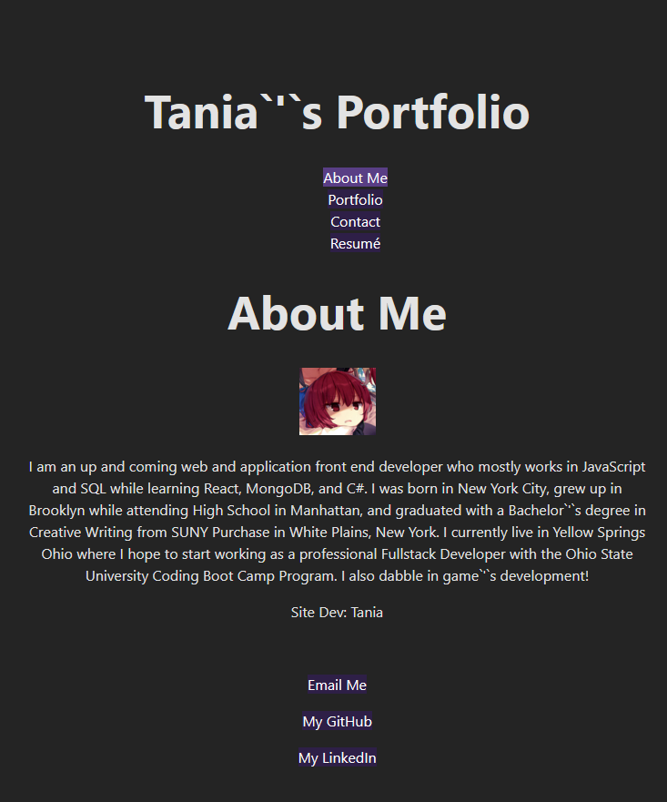

# Personal Portfolio & Professional Repository

This site is a collection of my completed and in progress coding projects, meant to act as a hub for anyone who would like to view my work and contact me for work or inquiries.

While it is still in progress, I currently have a very basic layout functioning within a React/JSX environment.

**Github Link**: [Here](https://github.com/Shrcker/tania-professional-portfolio)
**Deployment Link**: [Here](google.com)

## Installation

Visit the above deployment link to view the active application.

## Usage

Anyone who wishes to know more about me, contact me, or simply view my past work and experience may visit this site. My email and professional links are displayed throughout the site, and the Contact Me Page has a simple contact form from which you can shoot me an email.

*please note that this contact form feature is still being worked on, for now the form simply returns your message into the console*

## Credits

Thanks goes to Sandra, a tutor at Ohio State University who helped me with the Portfolio page extensively. 
